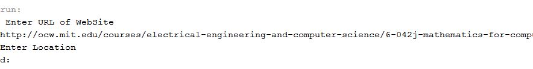

##File Downloader

This program downloads all file like PDF, JPG, PNG available on URL given as a input and stores it to the given location.I wrote this code to make the task of downloading large number of file from some course website(e.g. Coursera).

##How To Run This Program

There is only one File,

`FileDownload.java` **This program will prompt you for URL of website from which you want to download the PDFs and location to where you want to store downloaded file. If you want to download PDFs from some authenticated website like coursera then you need to copy the cookie to the cookie variable.Otherwise leave it blank.**

Screen Shot:

###### You can also change regular expression to download other files like JPG PNG TXT
